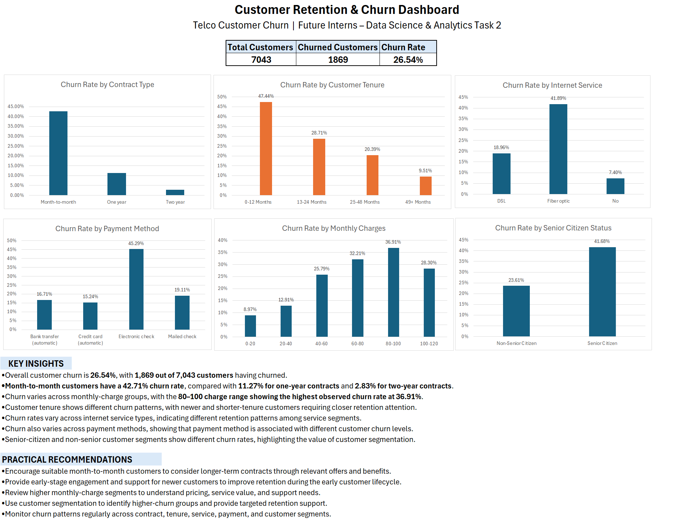

# FUTURE_DS_02 – Customer Retention & Churn Analysis

## Project Overview

This project was completed as part of the Future Interns Data Science & Analytics Internship.

The project focuses on analyzing customer churn and retention patterns in a subscription-based business using Microsoft Excel. The analysis looks at customer contracts, tenure, internet service, payment methods, monthly charges, and customer segments to understand different churn patterns.

The final result is an Excel dashboard with key churn metrics, charts, insights, and practical recommendations.

## Objectives

The main objectives of this project are:

- Calculate the overall customer churn rate.
- Analyze churn based on contract type.
- Study customer tenure and lifetime patterns.
- Compare churn across internet service types.
- Compare churn across payment methods.
- Analyze churn across monthly charge ranges.
- Compare churn between senior-citizen and non-senior customers.
- Identify customer segments with different churn levels.
- Provide practical recommendations for improving customer retention.

## Tools Used

- Microsoft Excel
- Excel Tables
- PivotTables
- Data Cleaning
- Data Analysis
- Charts and Data Visualization
- Excel Dashboard

## Dataset

The project uses a Telco Customer Churn dataset containing customer, subscription, service, billing, tenure, and churn information.

Total customer records: 7,043

## Data Cleaning

The following data preparation steps were completed:

- Converted the dataset into an Excel Table named `CustomerData`.
- Checked `customerID` for duplicate records.
- No duplicate customer IDs were found.
- Found 11 blank values in the `TotalCharges` column.
- Replaced the blank `TotalCharges` values with 0.
- Created `TenureGroup` categories for customer lifetime analysis.
- Prepared the cleaned data for PivotTable and dashboard analysis.

## Analysis Performed

### 1. Overall Churn Analysis

The overall churn rate was calculated from the customer data.

- Total customers: 7,043
- Churned customers: 1,869
- Overall churn rate: 26.54%

### 2. Churn by Contract Type

Churn was compared across different contract types.

- Month-to-month: 42.71%
- One year: 11.27%
- Two year: 2.83%

The analysis shows different observed churn levels across contract types.

### 3. Customer Tenure Analysis

Customers were grouped into different tenure ranges to study customer lifetime patterns and churn.

The tenure groups used in the analysis were:

- 0–12 Months
- 13–24 Months
- 25–48 Months
- 49+ Months

Since the dataset does not contain customer signup dates or signup months, tenure groups were used instead of creating signup-month cohorts.

### 4. Churn by Internet Service

Churn rates were compared across different internet service types to identify differences in observed churn patterns between service segments.

### 5. Churn by Payment Method

Churn rates were compared across different payment methods to identify variations between payment segments.

### 6. Churn by Monthly Charges

Customers were grouped into monthly charge ranges and their churn rates were compared.

The 80–100 monthly-charge range recorded the highest observed churn rate at 36.91%.

### 7. Churn by Senior Citizen Status

Churn was compared between senior-citizen and non-senior customer groups to understand differences between these customer segments.

## Key Insights

- The overall customer churn rate is 26.54%, with 1,869 out of 7,043 customers having churned.
- Month-to-month customers recorded a 42.71% churn rate, compared with 11.27% for one-year contracts and 2.83% for two-year contracts.
- The 80–100 monthly-charge range had the highest observed churn rate at 36.91%.
- Customer tenure shows different churn patterns across the customer lifecycle.
- Churn rates vary across internet service types and payment methods.
- Senior-citizen and non-senior customers show different observed churn patterns.

## Practical Recommendations

Based on the observed patterns, the following actions can be considered:

- Encourage suitable month-to-month customers to consider longer-term contracts through relevant offers and benefits.
- Provide early-stage support and engagement for newer customers.
- Review higher monthly-charge segments to understand pricing, service value, and support needs.
- Use customer segmentation to identify higher-churn groups and provide targeted retention support.
- Regularly monitor churn across contract type, tenure, service type, payment method, and customer segments.

## Dashboard

The Excel dashboard includes:

- Total Customers
- Churned Customers
- Overall Churn Rate
- Churn Rate by Contract Type
- Churn Rate by Customer Tenure
- Churn Rate by Internet Service
- Churn Rate by Payment Method
- Churn Rate by Monthly Charges
- Churn Rate by Senior Citizen Status
- Key Insights
- Practical Recommendations

### Dashboard Preview

## Project Files

The repository contains the following files:

- `Customer_Retention_Churn_Analysis.xlsx` – Complete Excel analysis and dashboard.
- `Customer_Retention_Churn_Dashboard` – Dashboard preview image.
- `README.md` – Project documentation.

## Data Limitation

The dataset contains a `Churn` field but does not contain a specific field explaining the reasons for customer churn.

Therefore, this project focuses on observed churn patterns and customer segments rather than assigning specific causes to churn.

Also, signup dates are not available in the dataset. Therefore, tenure-based groups were used for customer lifetime analysis instead of creating signup-month cohorts.

## Conclusion

This project provides an Excel-based analysis of customer churn and retention patterns. The dashboard brings together important churn metrics, customer segmentation, visualizations, and practical recommendations that can help a subscription-based business monitor customer retention.
